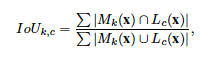

# NetDissectResults
Comparing the interpretability of different DL models. Based on the NetDissect-lite repo

## Background
Interpretability is important because

This work is based on previous [work](http://netdissect.csail.mit.edu/) by David Bau, Bolei Zhou, Aditya Khosla, Aude Oliva, and Antonio Torralba, who introduced Network Dissection - more specifically the paper [Network Dissection: Quantifying Interpretability of Deep Visual Representations](http://netdissect.csail.mit.edu/final-network-dissection.pdf) and the belonging repository [NetDissect-Lite](https://github.com/CSAILVision/NetDissect-Lite).

Our work is part of the course Research Methodology and Scientific Writing at KTH.  

## Intro
Human Interpretable concepts sometimes emerge as individual latent variables within hidden layers - even in networks which are not constructed or constrained to decompose problems with respect to interpretability. This behaviour suggests that deep networks may be learning disentangled representations spontaneously.

### Interpretability of Unit score:

The IoU score of a node k for a concept c, is defined as:

Which can be interpreted as (the sum of the data-set-wide intersection of the part of the image activated by k and the part of the image containing concept c) / (the sum of the data-set-wide union of the part of the image activated by k and the part of the image containing concept c):

### Interpretability of a layer
The interpretability of a layer is quantified as the number of _unique detectors_.
